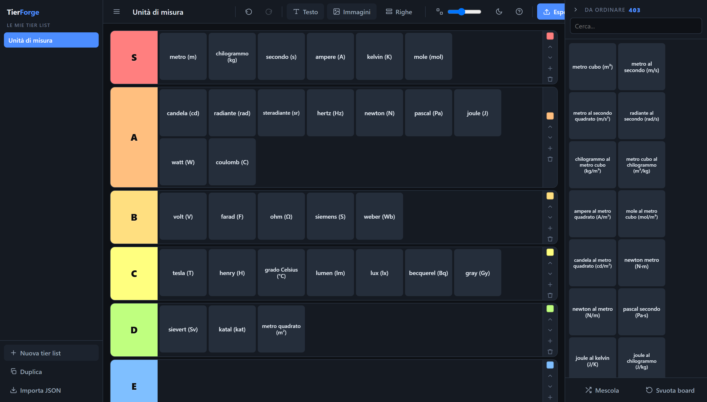

# TierForge

Tier list maker in un solo file HTML. Nessuna build, nessuna dipendenza, funziona offline.

**[▶ Demo](https://g95g95.github.io/tierforge/)**



## Cosa fa

- **Tessere di testo o immagine.** Incolli un elenco (una voce per riga) e diventa
  una tessera per riga; oppure trascini immagini, anche cartelle intere.
- **433 unità di misura già caricate al primo avvio** — SI, derivate, imperiali,
  prefissi, storiche, nautiche e altro: apri e inizi a ordinare, zero setup.
- **27 preset di dati** (unità di misura, informatica, sport, bar di Ascoli…)
  e 6 strutture di righe (S–F, giudizio, voti 1–10…): ogni preset si accoda alla
  textarea oppure diventa con un clic una nuova tier list già popolata.
- **Drag & drop** con segnaposto di inserimento, multi-selezione, supporto touch.
- **Export** PNG fino a 4x, JSON completo (immagini incluse) e testo negli appunti.
- **Multi-progetto**, undo/redo, ricerca, zoom tessere, tema chiaro/scuro.
- **Tutto in locale**: i dati restano nel browser (IndexedDB), niente server né account.

## Uso

Scarica `index.html` e aprilo col browser. Fine.

Oppure clona e apri:

```bash
git clone https://github.com/g95g95/tierforge.git
cd tierforge
start index.html      # Windows   (macOS: open, Linux: xdg-open)
```

## Come si aggiungono gli elementi

Al primo avvio le 433 unità di misura sono già nel pool, pronte da trascinare.

Per aggiungerne altre: **Testo** → scrivi o incolla nella textarea, una voce per riga
(righe vuote e duplicati vengono scartati). In alternativa clicca uno dei preset: le voci
si accodano nella textarea, così puoi combinarne più di uno prima di confermare — oppure
usa *+ come nuova tier list* sulla card del preset per aprirlo direttamente come lista
a sé, senza toccare quella corrente.
Il pulsante *Carica TUTTE le unità di misura* le rimette tutte in un colpo.

**Immagini** → trascina file o cartelle nella dropzone, usa il file picker,
incolla con `Ctrl+V` o scarica da URL.

Le tessere finiscono nel pannello *Da ordinare*. Da lì trascinale nelle righe, oppure
selezionale (`Ctrl+clic`, `Shift+clic`, `Ctrl+A`) e premi `1`–`9` per mandarle nella
riga corrispondente — molto più veloce quando le tessere sono centinaia.

## Scorciatoie

| Tasto | Azione |
|---|---|
| `Ctrl` + clic | selezione multipla |
| `Shift` + clic | seleziona intervallo |
| `Ctrl+A` | seleziona tutto il pool |
| `1`–`9` / `0` | manda la selezione nella riga N / nel pool |
| `Canc` | elimina le tessere selezionate |
| `Ctrl+Z` / `Ctrl+Y` | annulla / ripeti |
| `Ctrl+V` | incolla immagini dagli appunti |
| `Esc` | deseleziona / chiudi finestra |

## Note tecniche

Vanilla JS, zero dipendenze. Persistenza su IndexedDB (localStorage non regge le
immagini), drag&drop su Pointer Events (per il segnaposto preciso e il touch),
export PNG disegnato a mano su canvas (per non dipendere da html2canvas e restare
utilizzabile offline). Dettagli e motivazioni in [CLAUDE.md](CLAUDE.md).

Testato end-to-end con Playwright: 34 asserzioni su boot, import, drag&drop,
undo/redo, persistenza, export e multi-progetto.

## Licenza

MIT
